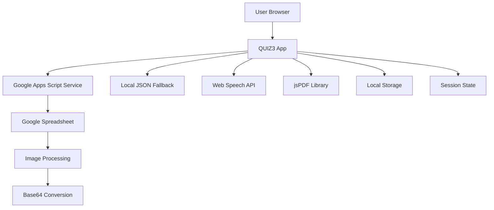

# Design Document

## Overview

QUIZ3 is a client-side quiz application that fetches data from Google Apps Script and presents an interactive image-based quiz experience. The application uses modern web technologies including JSONP for data fetching, Web Speech API for accessibility, jsPDF for result generation, and responsive CSS for cross-device compatibility.

## Architecture

### High-Level Architecture



### Data Flow

1. **Initialization**: App loads and attempts to fetch quiz data from Google Apps Script
2. **Data Processing**: Quiz data with base64 images is parsed and stored in memory
3. **Quiz Session**: User navigates through shuffled questions with state management
4. **Results Generation**: Score calculation and optional PDF generation
5. **Restart Capability**: State reset for new quiz sessions

## Components and Interfaces

### Core Components

#### 1. Data Loader (`loadQuizData()`)
- **Purpose**: Fetches quiz data from Google Apps Script or local fallback
- **Methods**:
  - `fetchGoogleService(url)`: JSONP implementation for CORS-free requests
  - `convertGoogleDriveUrl(url)`: Converts Google Drive URLs to direct download links
  - `loadLocalData()`: Fallback to local JSON file
- **Error Handling**: Timeout management, retry mechanisms, user-friendly error messages

#### 2. Quiz Engine
- **State Management**:
  ```javascript
  const state = {
    currentIndex: 0,
    selections: Array.from({ length: quizData.length }, () => null),
    score: 0
  };
  ```
- **Core Methods**:
  - `renderQuestion()`: Displays current question with shuffled choices
  - `shuffleArray()`: Fisher-Yates algorithm implementation
  - `onChoose(index)`: Handles answer selection
  - `nextQuestion()` / `prevQuestion()`: Navigation logic

#### 3. UI Components
- **Progress Bar**: Visual progress indicator with ARIA attributes
- **Question Display**: Clickable images with captions
- **Choice Buttons**: Interactive answer options with visual feedback
- **Navigation Controls**: Previous/Next buttons with keyboard support

#### 4. Accessibility Layer
- **Speech Synthesis**:
  - Voice selection and language preferences
  - Caption reading on image clicks
  - Configurable speech parameters (rate, pitch, volume)
- **Keyboard Navigation**:
  - Number keys (1/2/3) for answer selection
  - Arrow keys for question navigation
  - Enter key for progression

#### 5. Results System
- **Score Calculation**: Compares user selections with correct answers considering shuffled data
- **PDF Generation**: Uses jsPDF to create detailed result reports
- **Visual Indicators**: Green borders for correct, red diagonal lines for incorrect

## Data Models

### Quiz Data Structure
```javascript
{
  "questions": [
    {
      "prompt": {
        "imageBase64": "data:image/jpeg;base64,/9j/4AAQ...",
        "caption": "Question description"
      },
      "choices": [
        {
          "id": "unique_choice_id",
          "imageBase64": "data:image/jpeg;base64,/9j/4AAQ...",
          "caption": "Answer option description"
        }
      ],
      "correctAnswerId": "unique_choice_id",
      "shuffledData": {
        "choices": [...], // Shuffled array
        "correctIndex": 0 // Index of correct answer in shuffled array
      }
    }
  ]
}
```

### Application State
```javascript
{
  currentIndex: number,        // Current question index
  selections: (number|null)[], // User selections for each question
  score: number,              // Final calculated score
  quizData: QuizQuestion[]    // Loaded quiz questions
}
```

### Configuration
```javascript
{
  GOOGLE_SERVICE_URL: string,     // Google Apps Script endpoint
  selectedVoice: SpeechSynthesisVoice | null,
  selectedLanguage: string,       // Default: 'es-ES'
  speechSettings: {
    rate: 0.9,
    pitch: 1.0,
    volume: 1.0
  }
}
```

## Error Handling

### Network Errors
- **Google Service Timeout**: 90-second timeout with countdown display
- **JSONP Failures**: Script loading error detection and cleanup
- **Fallback Strategy**: Automatic fallback to local JSON file

### Data Validation
- **Quiz Data Validation**: Verify required fields (prompt, choices, correctAnswerId)
- **Image Loading**: Error handling for corrupted base64 data
- **State Consistency**: Validate selections array length matches questions

### User Experience Errors
- **Speech Synthesis**: Graceful degradation when Web Speech API unavailable
- **PDF Generation**: Error handling for jsPDF library issues
- **Responsive Layout**: Fallback layouts for unsupported screen sizes

## Testing Strategy

### Unit Testing Focus Areas
- **Shuffle Algorithm**: Verify Fisher-Yates implementation correctness
- **Score Calculation**: Test with various selection patterns and shuffled data
- **JSONP Implementation**: Mock Google service responses
- **State Management**: Test navigation and selection persistence

### Integration Testing
- **Google Apps Script**: Test with actual service endpoints
- **Speech Synthesis**: Test across different browsers and voices
- **PDF Generation**: Verify output format and content accuracy
- **Responsive Design**: Test across device breakpoints

### Accessibility Testing
- **Screen Reader Compatibility**: Test with NVDA, JAWS, VoiceOver
- **Keyboard Navigation**: Verify all functionality accessible via keyboard
- **Speech Synthesis**: Test voice selection and language switching
- **ARIA Attributes**: Validate semantic markup

### Performance Testing
- **Base64 Image Loading**: Test with large image datasets
- **Memory Usage**: Monitor during long quiz sessions
- **PDF Generation**: Test with maximum question counts
- **Mobile Performance**: Test on low-end devices

## Security Considerations

### Data Privacy
- **No Server Storage**: All data processing happens client-side
- **Base64 Images**: No external image requests after initial load
- **Local Storage**: Minimal use, no sensitive data persistence

### Content Security
- **JSONP Safety**: Validate callback function names
- **XSS Prevention**: Sanitize any user-generated content
- **Image Validation**: Verify base64 format before processing

## Browser Compatibility

### Minimum Requirements
- **Modern Browsers**: Chrome 60+, Firefox 55+, Safari 12+, Edge 79+
- **JavaScript Features**: ES6 support, Promises, Fetch API
- **Web APIs**: Speech Synthesis (optional), Canvas (for PDF)

### Progressive Enhancement
- **Speech Synthesis**: Graceful degradation when unavailable
- **PDF Generation**: Optional feature with fallback messaging
- **Advanced CSS**: Fallback layouts for older browsers

## Deployment Considerations

### Static Hosting
- **File Structure**: Single HTML file with embedded CSS/JS or separate files
- **CDN Dependencies**: jsPDF library from CDN with local fallback
- **Caching Strategy**: Appropriate cache headers for static assets

### Google Apps Script Setup
- **Service Configuration**: CORS-free JSONP endpoint
- **Image Processing**: Server-side base64 conversion
- **Error Response Format**: Standardized error object structure